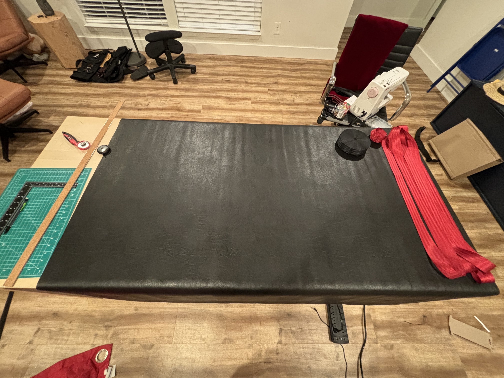
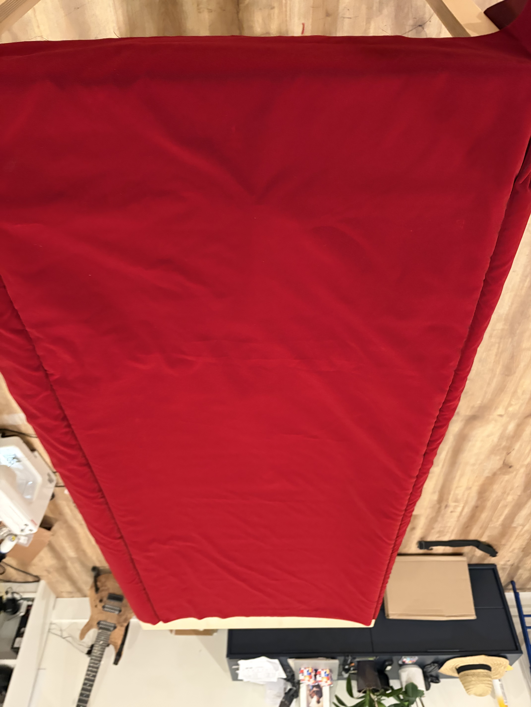
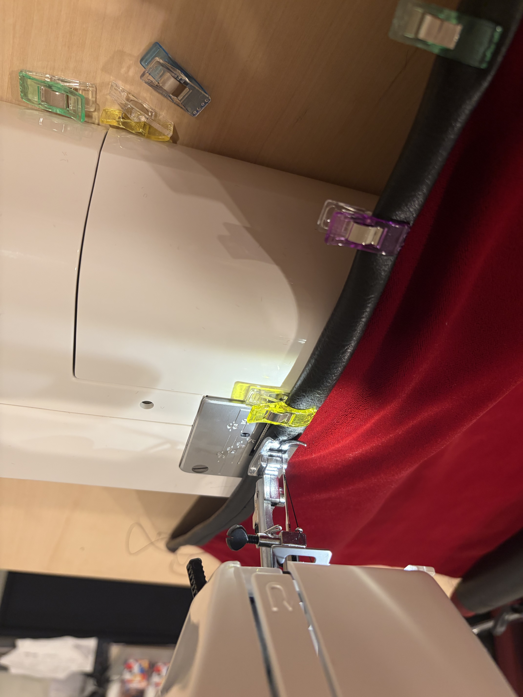
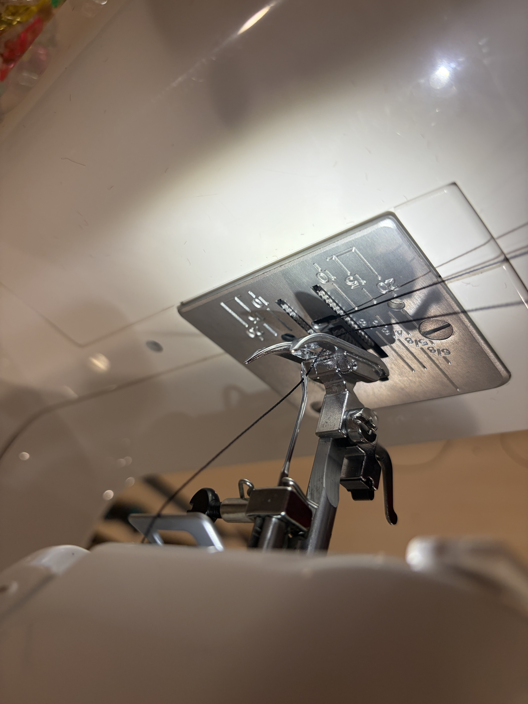

--- 
title: "Making a faux-leather rolling bag with a velvet inside" 
summary: "It will only take a couple of weeks."
categories: ["Projects"] 
tags: ["Projects"] 
#externalUrl: "" 
showSummary: true
date: 2025-11-16 
showTableOfContents : true
---

## Context

My wife and I travel regularly to attend BDSM parties. That's our thing.

Until two months ago, my preferred tool bag was a cheap Amazon suitcase with one big space for all whips and paddles, and many smaller pouches for rings, carabiners, chains, etc...

With a bit of imagination (and a pack of ponytail rubber bands) I managed to keep it ordered before the show. Though, as our scene progressed and I used more and more tools, it became more and more difficult to retrieve anything from it.

Two months ago, I ran into [the KingBag](https://luxxgear.com/products/kinkbag-luxury-bdsm-fetish-gear-roll-up-toy-bag) and I really liked the design.

Being blessed with a sewing machine, some needles, some yards of Cordura, some time to spend and some sanity to lose, I attempted to do it myself and it went rather well.



It was good for a first attempt. But I was not satisfied with a few things :
- it was not big enough.
- the cordura looked really cheap.
- the webbing I chose was also cheap.
- the webbing was too thin and not rigid enough, which allowed the D-rings to rotate.
- the velvet inside was elastic and cheap.
- the pouches looked bad and were not so useful overall.

Overall, I wanted something that looked better.

After a few days of evening work, I'm proud to say that the result looks and feels really good, and was not that pricey.



This article shows the build process.

## Materials

My expected size is 30'' by 50'', adapt the dimensions to your needs.

In all the rest of the article, the 30'' side will be referred to as `height` and the 50'' side will be referred to as `width`.

The bag is composed of :
- an exterior fabric which will give its structure.
- an interior fabric which will be in contact with the toys.
- elastic strap to hold the toys in place in the non-pocket areas.
- 1.5'' D-rings to clip the shoulder strap and the handle, so as inside toys if needed.
- straps to close the bag.
- buckle belts to close the bag.
- a webbing construction to hold :
  - the D-rings where the handle shoulder strap will be attached.
  - the straps that close the bag.

I chose faux leather as exterior material and dark red velvet as inside.

I bought both of those at the HobbyLobby store close to my house and I have no complaints so far. I really recommend checking the fabric yourself as you may be disappointed like I was with the quality of what you buy online, especially for something whose secondary purpose is to FEEL GOOD.

Dimensions :
- leather : 55'' x 3 yards.
- velvet : 46'' x 3 yards.

The inch dimensions were imposed by HobbyLobby.

I bought 1 inch D-rings from Amazon. They look good but are a bit wide, so be careful when you buy them. I don't know where to get them locally so Amazon it is.

I bought the strap on Amazon. I searched for "Heavy Duty 1.5'' Polyester webbing" and got a good one.

For the buckle belts, I went for a quick-release full-metal buckle model that looked cool.

## Preparation

Cut three 35'' straps of webbing, those will be the ones closing the bag.

Cut two 34'' straps, which will compose the base of the webbing structure.

Cut one 32'' strap which will be placed on top of the two others to hold the D-rings.


In the pictures below, you'll notice that the 32'' strap was replaced by two 20'' straps.
This is because I actually changed my mind after messing up the sewing of the two base straps on the webbing construction, and decided to unify those two straps to cover up my mess.
Do yours the way you want.






## Drawing

Line up the leather on your table and find the middle point of the height side.

Draw a perpendicular, then 7 inches later mark a point which will be the middle of the base of the webbing construction to hold the rings.

From this point, draw a 30'' x 3'' rectangle which will help us correctly place the webbing.

At the contour of this rectangle, write markings for the location where the bag's closing straps will go. One should be centered in the middle, and the two others were placed at 4 inches of the rectangle's ends in my build.

On the picture you can see the final marked rectangle, the three (middle one is on the sewing machine) straps that will close the bag, and the two straps that will be under the D-rings.





## Placing our webbing


The exact straps placement is difficult to explain and is much more easily understood with pictures. When in doubt with my explanations, please look at the picture.
The guidelines below allow you to place everything before making the single stitch, so please verify that what you end up with is similar to what the pictures suggest before sewing anything.


Place a line of double side tape where the closing strap contact points.





Then, place the straps.





Place a line of double sided tape inside the straps.





Then insert the other end of the straps in the relevant half buckles, and fold the straps on top of the tape lines you just placed to enclose those.

The folded strap with the buckle inside should stick out of the base rectangle of 2.5''





Then, place 8 segments of double sided tape where the middle of the base straps will be located.
Then, expose the double sided tape on the middle sections only, and place the base straps.





Now, expose the double sided tape on the extremal sections and fold the base straps.





It is possible to sew them as is but in my case I finished this step before going to sleep so I took advantage of the night and used the heaviest things I could find (i.e two books on computer architecture and some training weights) to let the straps get used to the fold during the night.

Be sure not to have the weights directly touch the leather.





## Stitching our webbing

Now that we have our webbing in position, we need to sew it.

I selected a zigzag pattern and a black bonded nylon thread to stitch the webbing and the leather.

Start by folding the unused part of the leather and put the outside straps inside to avoid them bothering you when you stitch.

Then do four lines of stitching.





As you probably will have noticed, I did an incredibly poor stitching job and my zigzag pattern is dead irregular.
This is due to two things :
- the subparity of my sewing skills.
- the fact that my machine is not made to stitch such thickness and that it had trouble pulling the fabric. This will be a running gag in the process, which made me change to a line stitching pattern.

## Placing the top D-rings

Mark the locations where you want your D-rings to be, then put three segments of double sided tape each stopping at 1in from the related D-ring position.

Then, place your top webbing, place the D-rings and finally, fold the extremities of the webbing





Do one line of stitching on each side of each external D-ring, then do the same for the middle ones. This is to avoid tensing the fabric more on one side.





Finally do six lines of (INLINE !) stitching to make the top strap stick to the base ones.





## Stitching the leather and the velvet

We'll start by properly aligning the velvet and the leather.

Place the leather on the ground and draw straight lines parallel to the width side, intersecting with the rectangle we drew to position the webbing.


In the pictures below, you'll notice that the stitches made the leather and webbing sorta shrink.
I originally thought it would be a problem but in fact no, you just need to ensure that your lines are straight and you just end up with a slightly (2'') smaller bag.


Now, place the velvet on top of the bag, center it, and mark its positions on both height sides.

Then, place the velvet on the ground (interior side touching the ground), and place the leather on top of it.

Use your markings to retrieve the previous centered position, then place sewing pins along the lines you drew on the leather. We will stitch along those lines so this is to make sure that the velvet and the leather do not displace while doing so.

Then, put the assembly on your table, finish attaching the velvet and the leather by folding the leather around the velvet and adding clips. This will help maintain things in place while stitching.

Then, warm up the sewing machine again and do two straight stitching lines along the lines you drew and along which you placed the pins.





## Folding and stitching

Next, fold the assembly along the lines you just stitched, leather on the exterior, place clips to hold it in place, and do another straight stitch line to make the fold permanent.





## Stitching the interior hems

Start by choosing how large you want the interior pockets to be.

Then, follow the procedure below for both sides.

Add an inch and a half for the hem, and cut the leather to the desired length, making sure you don't cut the velvet below.

Then carefully roll the leather around the velvet to form the hem and place clips all along to make it stay in place, and finish the job with a single straight stitch line.





## Stitching the height sides hems

Cut two segments of elastic strap to cover the full width of the bag.

Start by removing the velvet and the pockets on 2 inches on both sides, leaving nothing but the outside leather.

Then, roll the exposed leather in two, carefully placing the elastic strap in the hem, and fold it a third time against the pockets and velvet to close the structure.

Attach everything with clips and try your best to sew the whole thing.

There will be in total 5 layers of leather plus two layers of velvet on the corners.

It is unlikely that your machine will appreciate it a lot and I broke a few needles trying to stitch the damn thing. If you're into leatherwork, I'd definitely recommend handling the corners manually with a few rounds of saddle stitching.





And there you have it, after some evenings, a few headbangs, a dozen broken needles, a sewing machine threatening to sue you, your bag is finally done !

## The result

I must say that I'm really happy with the result so far.

The velvet inside looks really cool and if you forget the $1 shoulder strap and the improvised handle, that's a pretty decent bag.





